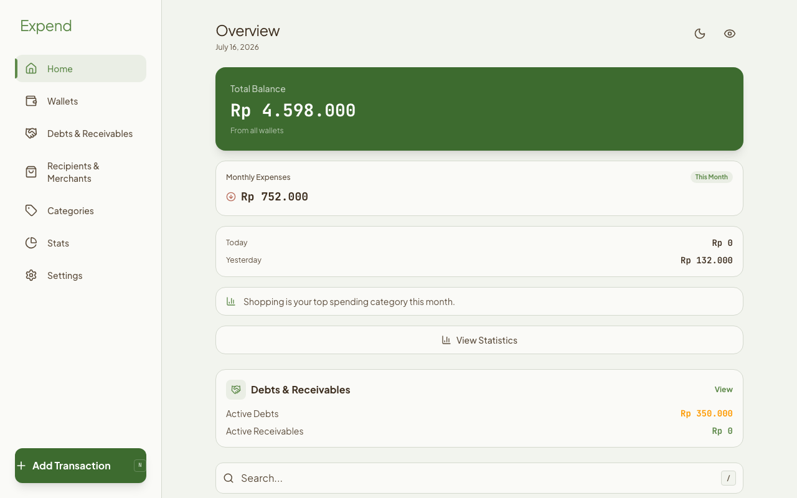
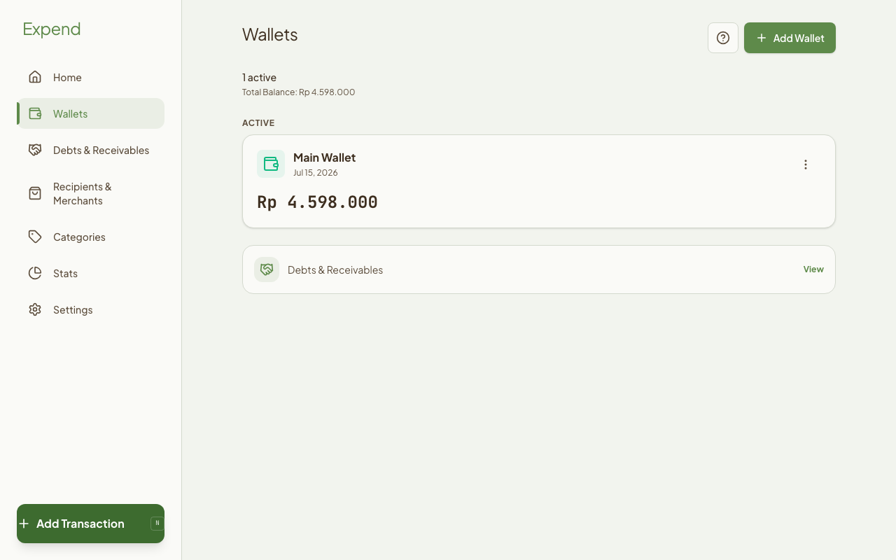
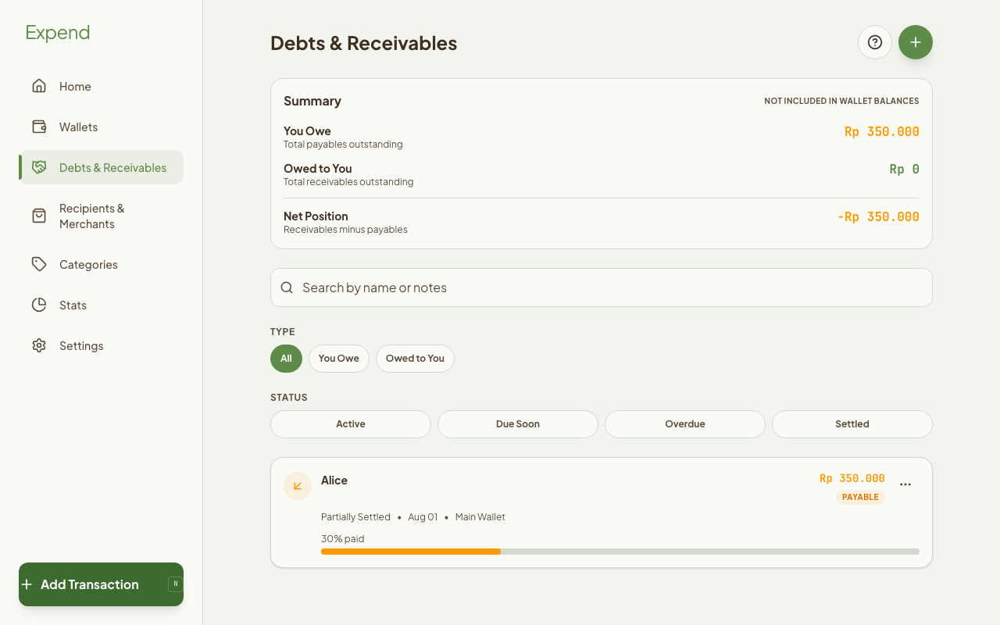
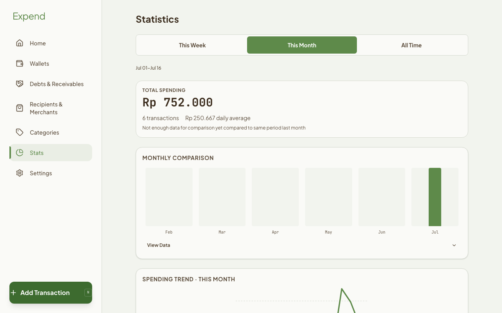
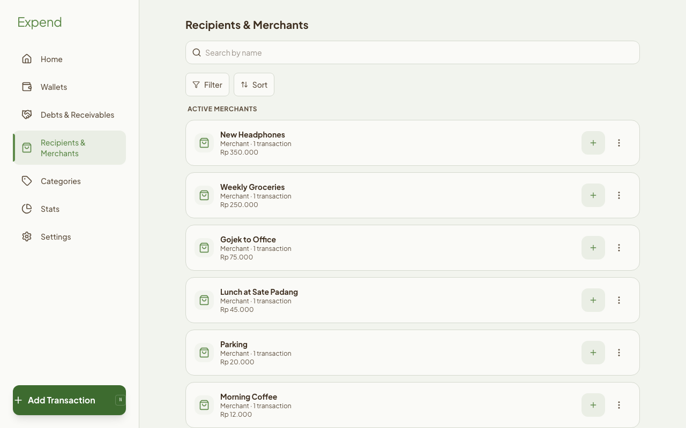
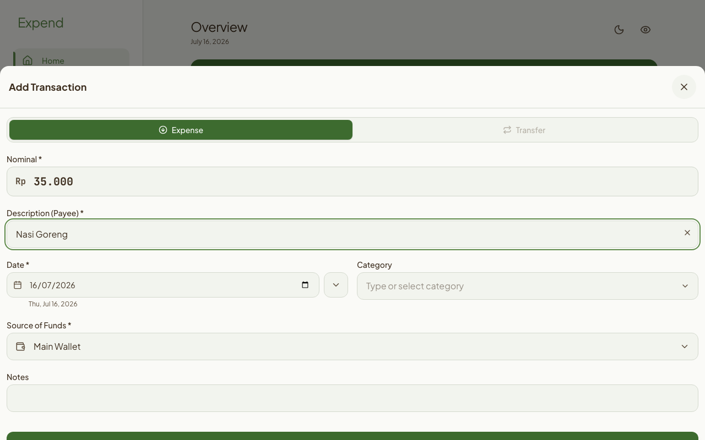

# Expend — Privacy-First Offline Expense Tracker PWA

<p align="center">
  
</p>

<p align="center">
  <a href="https://expend.pages.dev/">Live Demo</a> ·
  <a href="docs/screenshots/">Screenshots</a> ·
  <a href="CHANGELOG.md">Changelog</a>
</p>

<p align="center">
  
  
  
  
  
  
  
</p>

Expend is a local-first personal finance tracker for expenses, budgets, wallets, debts, receivables, and monthly reports. Built as an offline-capable Progressive Web App (PWA). Stores all financial data locally in IndexedDB — no account, no cloud sync, no tracking.

## Screenshots

| | | |
|---|---|---|
|  |  |  |
|  |  |  |

## Table of Contents

- [Why Expend](#why-expend)
- [Screenshots](#screenshots)
- [Features](#features)
- [Privacy and Data Ownership](#privacy-and-data-ownership)
- [Backup and Restore](#backup-and-restore)
- [Recurring Transaction Limitations](#recurring-transaction-limitations)
- [Support and Trakteer](#support-and-trakteer)
- [Tech Stack](#tech-stack)
- [Prerequisites](#prerequisites)
- [Quick Start](#quick-start)
- [Available Scripts](#available-scripts)
- [Testing and Quality Checks](#testing-and-quality-checks)
- [Deployment](#deployment)
- [Project Structure](#project-structure)
- [Troubleshooting](#troubleshooting)
- [Contributing](#contributing)
- [Changelog](#changelog)
- [License](#license)

## Why Expend

Most personal finance tools require an account, remote sync, or server-side storage. Expend is designed for people who want private expense tracking on their own device:

- Local-first financial data storage
- Offline expense tracking after the first load
- Multi-wallet balance tracking
- Debt and receivable monitoring
- Budget alerts and spending analytics
- English and Indonesian language support

## Features

- **Expense tracking** - Record spending with categories, wallets, dates, notes, and payees. Quick Add lets you save an expense in seconds, with smart payee and category suggestions.
- **Wallet management** - Track multiple wallet balances and transfer money between wallets. Reconcile balances against physical cash.
- **Debt and receivable tracking** - Record payables, receivables, partial payments, write-offs, and due dates, with proactive due-date reminders.
- **Budget monitoring** - Set monthly category budgets and get visual alerts near or over the limit.
- **Recurring transactions** - Define weekly, biweekly, monthly, or yearly schedules; the Upcoming section on Home shows what is due next.
- **Payee management** - Group and rename merchants or recipients across expense history, favorite frequent payees, and re-enter recurring expenses in one tap.
- **Actionable insights** - Home surfaces up to three drillable insights: unusual category increases, budget exhaustion projections, stale wallets, upcoming debts, and more. Each can be dismissed.
- **Statistics and reports** - Review interactive charts, category drill-downs, and monthly reports.
- **CSV and JSON data tools** - Full JSON backups with restore preview, plus a staged CSV import wizard: preview, validation report, duplicate detection (skip or import anyway), and automatic rollback via a pre-import snapshot.
- **Offline PWA support** - Install Expend on desktop or mobile for app-like access; the app reloads and works fully offline from the service worker cache.
- **Privacy controls** - Optional PIN screen lock with configurable auto-lock (Immediately, 5 minutes, 30 minutes, or Never) and a privacy mode that masks amounts on screen.
- **Internationalization** - Consistent English and Indonesian UI text.
- **Open source with optional support** - Free, ad-free, and open source. A non-intrusive, dismissible prompt occasionally points to the optional Trakteer support page; support links stay in Settings.

## Privacy and Data Ownership

Expend stores data in the browser's IndexedDB database on the current device. There is no login system, remote database, cloud sync, or advertising tracker. **Your data never leaves the device unless you explicitly export it** (backup file, CSV export, or restore-target file).

Important limitations:

- Clearing browser data or site storage permanently deletes local Expend data.
- PIN lock protects the app UI from casual access only.
- PIN lock does not encrypt IndexedDB data.
- Anyone with direct access to the browser profile may still be able to inspect local data.

For stronger protection, use encrypted devices, separate OS accounts, and encrypted backup storage.

## Backup and Restore

1. Open **Settings → Backup & Restore** accordion, tap **Export Full Backup** to download a JSON backup.
2. Store the JSON backup in a safe location.
3. Open **Settings → Backup & Restore** accordion, tap **Restore from Backup** to restore.
4. Import replaces existing app data; local PIN/security settings are preserved.

Expend also reminds you to back up: after your first 10 transactions, when the last backup is older than 30 days, and after 50 changes since the last backup. Reminders are non-blocking and can be postponed.

CSV import/export is available under **Settings → Transaction Import & Export**. JSON is the recommended format for full backup and restore; CSV is intended for transaction portability and spreadsheet workflows. CSV imports are previewed first, validated row by row, and checked for duplicates before anything is written.

## Recurring Transaction Limitations

- Schedules are processed when the app is opened; an occurrence due while the app was closed is created at the next open.
- A missed occurrence is not backfilled more than once (a repeated schedule run never duplicates an occurrence).
- Deleting a schedule stops future occurrences; past created transactions stay untouched.
- Remind-mode schedules only notify; they never create transactions.

## Support and Trakteer

Expend is free and open source. If it helps you, you can support its development on [Trakteer](https://trakteer.id/eiaiproject) — entirely optional. The app shows a dismissible support prompt only after meaningful usage (e.g. a first backup, a settled debt, 100 transactions, or 30 days of use), never more than once every 60 days, and it can be dismissed permanently. Support links are also always available under **Settings → About**. No financial data is ever included in external links.

## Tech Stack

- React 19
- TypeScript
- Vite 6
- Tailwind CSS 4
- Dexie.js and IndexedDB
- Recharts
- i18next and react-i18next
- Workbox and vite-plugin-pwa
- Vitest and Playwright

## Prerequisites

- **Node.js** ≥ 22
- **npm** ≥ 10

## Quick Start

```bash
git clone https://github.com/eiaiproject/Expend.git
cd Expend
npm install
npm run dev
```

The development server runs at `http://localhost:3000`.

### Install for first-time E2E testing

```bash
npm run playwright:install
```

## Available Scripts

| Command | Description |
| --- | --- |
| `npm run dev` | Start the development server |
| `npm run build` | Build the production app |
| `npm run preview` | Preview the production build |
| `npm run lint` | Run ESLint |
| `npm run typecheck` | Run TypeScript checks |
| `npm run i18n:check` | Verify locale key coverage |
| `npm run test:unit` | Run unit tests |
| `npm run test:e2e` | Run Playwright end-to-end tests |
| `npm run test:e2e:chromium` | Run Playwright end-to-end tests in Chromium |
| `npm run test:e2e:mobile` | Run Playwright end-to-end tests in Mobile Chrome (Pixel 5 viewport) |
| `npm run audit` | Check for critical npm vulnerabilities |
| `npm run qa:automated` | Run lint, typecheck, i18n, unit tests, build, and Chromium E2E |

## Testing and Quality Checks

```bash
npm run lint -- --max-warnings=0
npm run typecheck
npm run i18n:check
npm run test:unit
npm run build
npm run test:e2e:chromium
npm run test:e2e:mobile
```

Install Playwright browsers when running E2E tests on a fresh machine:

```bash
npm run playwright:install
```

## Deployment

```bash
npm run build
```

Deploy the `dist/` directory to a static host such as Cloudflare Pages, Netlify, Vercel, or GitHub Pages. The production build includes the app shell, PWA manifest, service worker, and optimized assets.

## Project Structure

```text
src/
|-- components/    # Shared UI components (cards, sheets, modals)
|-- contexts/      # Theme, security, and privacy providers
|-- db/            # IndexedDB schema, migrations, and repair logic
|-- hooks/         # React hooks (forms, filters, live queries)
|-- i18n/          # English and Indonesian locale files
|-- services/      # Business logic: transactions, payees, recurring,
|                  # backups, CSV, insights, support, budget
|-- utils/         # Utility helpers and constants
`-- views/         # Route-level screens

tests/
|-- unit/          # Vitest suites (fake-indexeddb)
`-- e2e/           # Playwright critical-path suites (Chromium)
```

## Troubleshooting

| Issue | Suggested fix |
| --- | --- |
| IndexedDB is unavailable | Disable private/incognito mode or use a supported browser profile |
| PWA install prompt does not appear | Use HTTPS or localhost and check browser install support |
| Service worker update is stuck | Clear site data in DevTools -> Application -> Storage |
| Data disappeared | Check whether browser/site storage was cleared and restore from JSON backup |
| E2E tests fail on a fresh machine | Run `npm run playwright:install` |

## Contributing

1. Fork the repository.
2. Create a branch: `git checkout -b feat/my-change`.
3. Make a focused change.
4. Run the relevant quality checks.
5. Commit using Conventional Commits, for example `fix: repair debt migration`.
6. Open a pull request.

## Changelog

See [CHANGELOG.md](CHANGELOG.md) for release notes.

## Author

**Anggie Irawan** - [anggieirawan.my.id](https://anggieirawan.my.id) - [GitHub](https://github.com/eiaiproject)

## License

[MIT](LICENSE)
